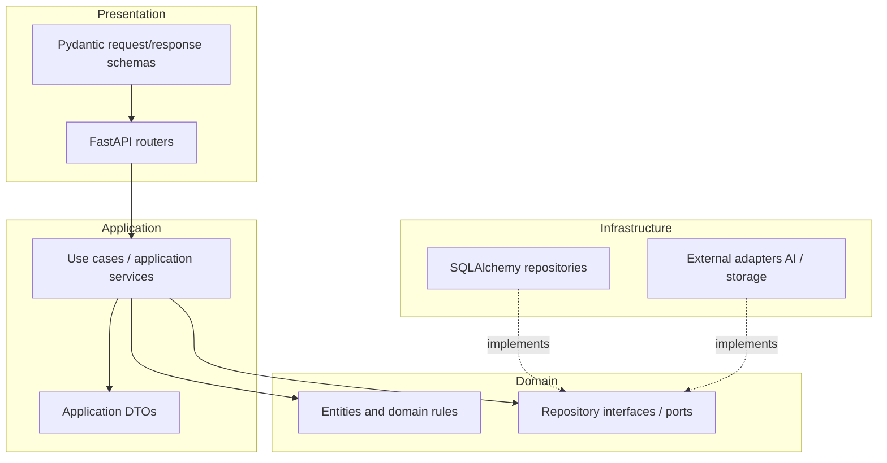

# Diagram 2 — Clean Architecture Layers

```mermaid
flowchart TB
  subgraph Presentation
    Routers[FastAPI routers]
    Schemas[Pydantic request/response schemas]
  end

  subgraph Application
    UseCases[Use cases / application services]
    AppDTO[Application DTOs]
  end

  subgraph Domain
    Entities[Entities and domain rules]
    Ports[Repository interfaces / ports]
  end

  subgraph Infrastructure
    Repos[SQLAlchemy repositories]
    Adapters[External adapters AI / storage]
  end

  Routers --> UseCases
  Schemas --> Routers
  UseCases --> Entities
  UseCases --> Ports
  Repos -.->|implements| Ports
  Adapters -.->|implements| Ports
  UseCases --> AppDTO
```

Dependency rule: **inward only**. Domain must not import FastAPI or SQLAlchemy.
