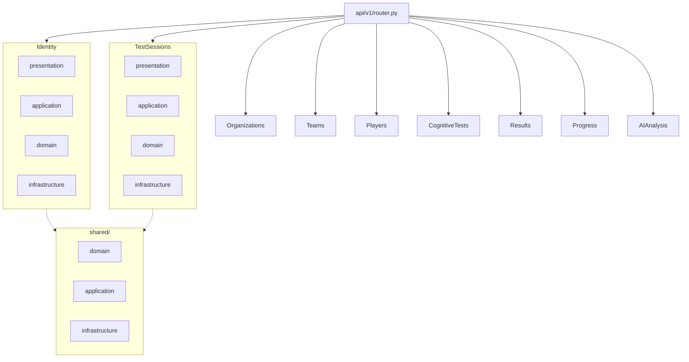

# Diagram 3 — Module Organization

```mermaid
flowchart TB
  API[api/v1/router.py]

  API --> Identity
  API --> Organizations
  API --> Teams
  API --> Players
  API --> CognitiveTests
  API --> TestSessions
  API --> Results
  API --> Progress
  API --> AIAnalysis

  subgraph Identity
    I1[presentation]
    I2[application]
    I3[domain]
    I4[infrastructure]
  end

  subgraph TestSessions
    S1[presentation]
    S2[application]
    S3[domain]
    S4[infrastructure]
  end

  subgraph Shared["shared/"]
    SD[domain]
    SA[application]
    SI[infrastructure]
  end

  Identity -.-> Shared
  TestSessions -.-> Shared
```

Each feature module owns its vertical slice. Shared code stays thin and non-feature-specific.
