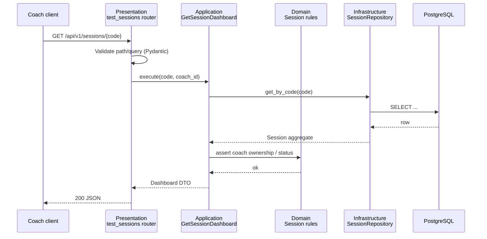

# Diagram 4 — Example Request Flow

Illustrative future flow: coach fetches a session dashboard. **Not implemented in this foundation.**

```mermaid
sequenceDiagram
  participant Client as Coach client
  participant API as Presentation<br/>test_sessions router
  participant UC as Application<br/>GetSessionDashboard
  participant Dom as Domain<br/>Session rules
  participant Repo as Infrastructure<br/>SessionRepository
  participant DB as PostgreSQL

  Client->>API: GET /api/v1/sessions/{code}
  API->>API: Validate path/query (Pydantic)
  API->>UC: execute(code, coach_id)
  UC->>Repo: get_by_code(code)
  Repo->>DB: SELECT ...
  DB-->>Repo: row
  Repo-->>UC: Session aggregate
  UC->>Dom: assert coach ownership / status
  Dom-->>UC: ok
  UC-->>API: Dashboard DTO
  API-->>Client: 200 JSON
```
